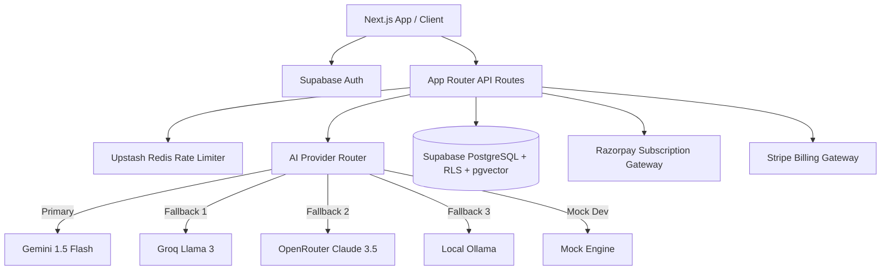
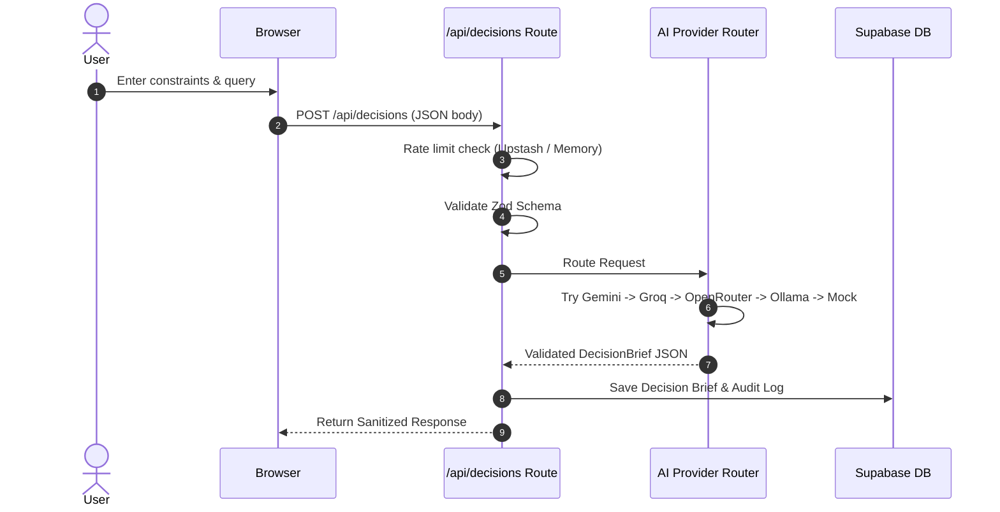

# Search.ai Architecture Documentation

## System Architecture

```mermaid
graph TD
    Client[Next.js App / Client] --> Auth[Supabase Auth]
    Client --> API[App Router API Routes]
    API --> RateLimit[Upstash Redis Rate Limiter]
    API --> AIRouter[AI Provider Router]
    
    AIRouter -->|Primary| Gemini[Gemini 1.5 Flash]
    AIRouter -->|Fallback 1| Groq[Groq Llama 3]
    AIRouter -->|Fallback 2| OpenRouter[OpenRouter Claude 3.5]
    AIRouter -->|Fallback 3| Ollama[Local Ollama]
    AIRouter -->|Mock Dev| Mock[Mock Engine]
    
    API --> DB[(Supabase PostgreSQL + RLS + pgvector)]
    API --> Razorpay[Razorpay Subscription Gateway]
    API --> Stripe[Stripe Billing Gateway]
```

## Request Flow Sequence

```mermaid
sequenceDiagram
    autonumber
    actor User
    participant Browser
    participant API as /api/decisions Route
    participant Router as AI Provider Router
    participant DB as Supabase DB

    User->>Browser: Enter constraints & query
    Browser->>API: POST /api/decisions (JSON body)
    API->>API: Rate limit check (Upstash / Memory)
    API->>API: Validate Zod Schema
    API->>Router: Route Request
    Router->>Router: Try Gemini -> Groq -> OpenRouter -> Ollama -> Mock
    Router-->>API: Validated DecisionBrief JSON
    API->>DB: Save Decision Brief & Audit Log
    API-->>Browser: Return Sanitized Response
```
